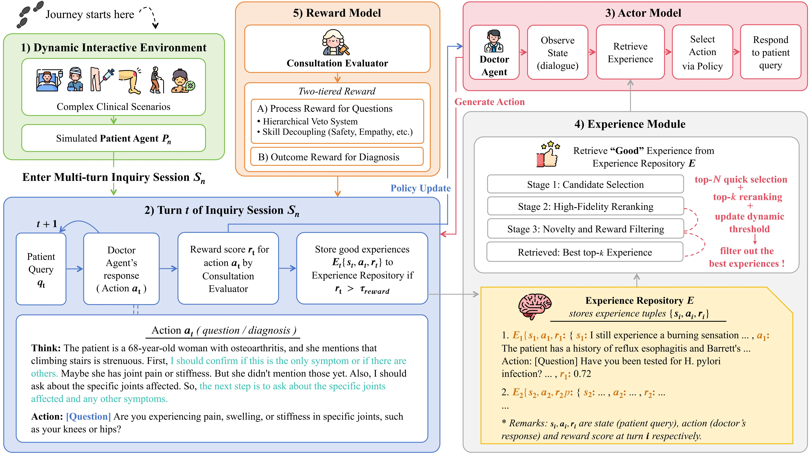
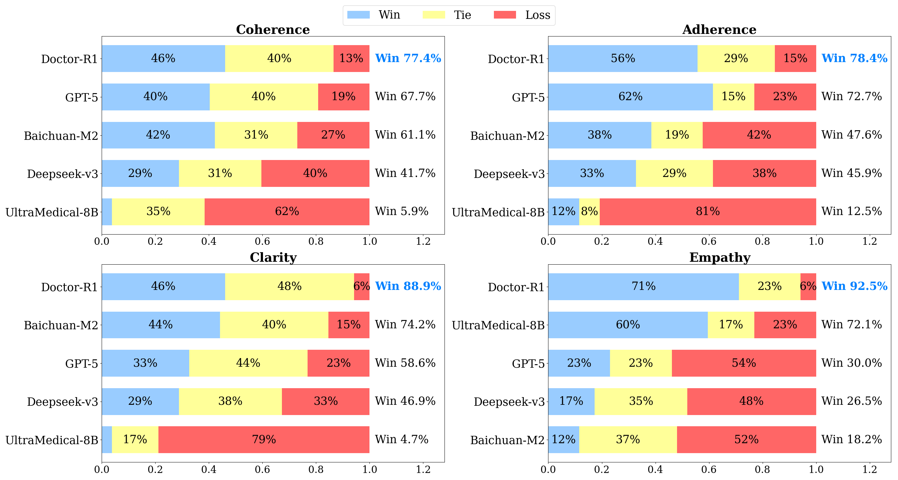
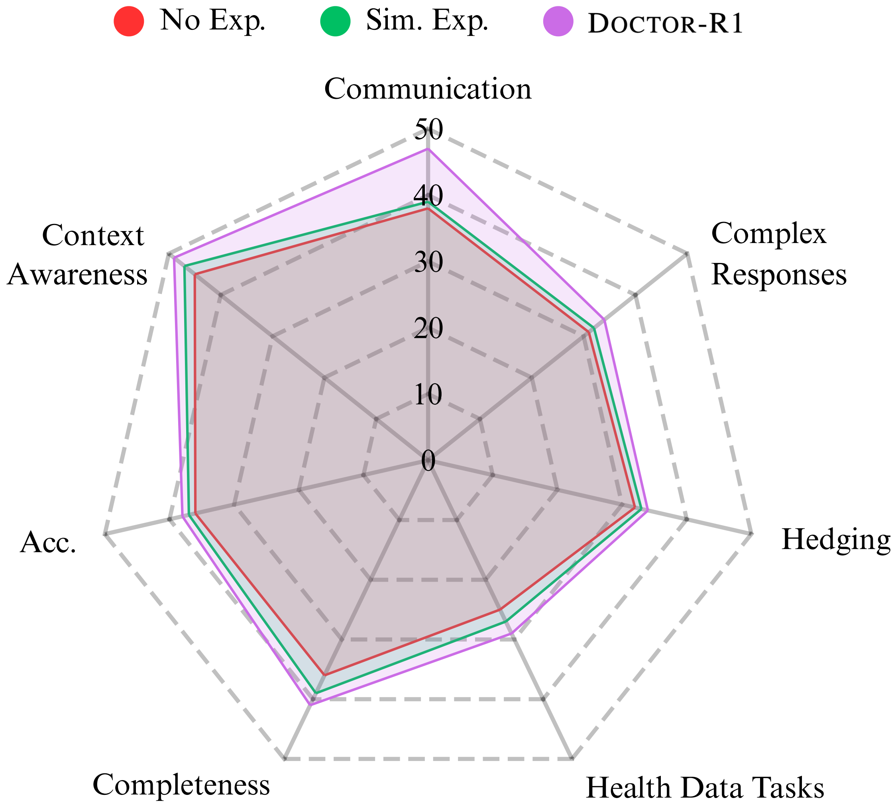
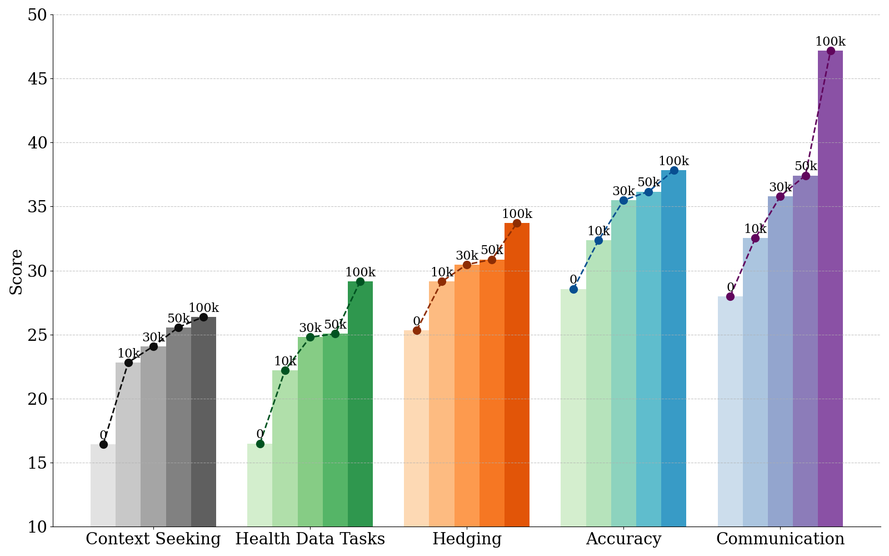

# Doctor-R1: Mastering Clinical Inquiry with Experiential Agentic Reinforcement Learning

<p align="center">
  <a href="https://arxiv.org/abs/2510.04284">
    
  </a>
  <a href="https://huggingface.co/unicornftk/Doctor-R1">
    
  </a>
  <a href="https://github.com/thu-unicorn/Doctor-R1/blob/main/LICENSE">
    
  </a>
</p>


> **Note:** The official code and model weights are now available! Please star ⭐ this repository to stay updated.

**Doctor-R1** is an AI doctor agent trained to conduct strategic, multi-turn patient inquiries to guide its diagnostic decision-making. Unlike traditional models that excel at static medical QA, Doctor-R1 is designed to master the complete, dynamic consultation process, unifying the two core skills of a human physician: communication and decision-making.




## 📰 News
* **[Dec 24, 2025]** 🚀 **Code Release:** We have released the core training code and the experiential reinforcement learning framework! See the [Installation](##-installation--usage) section below to get started.

* **[Oct 5, 2025]** 👨‍⚕️ **Expert Validation:** Licensed physicians verified that Doctor-R1's clinical competence matches proprietary models like GPT-5. Notably, experts rated **83.87%** of its retrieved experiences as *"Clinically Helpful"* with **0%** harmful content.

* **[Oct 5, 2025]** 🔥 We have released the paper for Doctor-R1. Doctor-R1 sets a new state-of-the-art for open-source medical agents (8B) on the challenging HealthBench benchmark, outperforming leading proprietary models like GPT-4.1 and Grok-4.

* **[Oct 5, 2025]** 🔥 On the MAQuE benchmark, Doctor-R1 matches GPT-4.1's accuracy while achieving a vastly superior Empathy score (**93.80** vs. 75.20).

* **[Oct 5, 2025]** 👥 **Patient Preference:** Our human evaluation confirms a strong preference for Doctor-R1, which achieves a remarkable **92.5% win rate** in Empathy against strong competitors.

  

## ✨ Key Features

* **Unified Clinical Skills:** The first agent framework to holistically integrate two core clinical skills, **strategic patient inquiry** and **accurate medical decision-making** within a single model.

* **Experiential Reinforcement Learning:** A novel closed-loop framework where the agent learns and improves from an accumulating repository of its own high-quality experiences.

* **Dual-Competency Reward System:** A sophisticated two-tiered reward architecture that separately optimizes for both conversational quality (soft skills) and diagnostic accuracy (hard skills), featuring a "safety-first" veto system.

* **State-of-the-Art Performance:** Outperforms leading open-source models on challenging dynamic benchmarks like HealthBench and MAQuE with high parameter efficiency.


## 🛠️ Installation & Usage

Doctor-R1 is built upon the [VeRL (Volcengine Reinforcement Learning)](https://github.com/volcengine/verl) framework. Our implementation serves as a "plugin" extension to the official VeRL codebase. To use Doctor-R1, you need to clone the official VeRL repository and then overlay our custom implementation (trainers, interactions, utils) onto it.

```bash
# 1. Clone the official VeRL repository
git clone https://github.com/volcengine/verl.git

# 2. Clone the Doctor-R1 repository (this repo)
git clone https://github.com/thu-unicorn/Doctor-R1.git

# 3. Integration: Copy Doctor-R1 files into the VeRL directory
# This command assumes both folders are in the same parent directory.
# We overwrite the specific files in verl with our custom implementations.
cp -r Doctor-R1/verl/* verl/verl/ 
cp Doctor-R1/run_doctor_multirollout.sh verl/

# 4. Install dependencies
cd verl
pip install -e .
```

Once set up, you can run the multi-rollout training process using our provided script:

```bash
bash run_doctor_multirollout.sh
```


## 🏆 Leaderboards

Doctor-R1 demonstrates state-of-the-art performance among open-source models and surpasses several powerful proprietary models on HealthBench. It demonstrates superior performance on dynamic benchmarks and strong foundational knowledge on static QA tasks.

| Benchmark          | Key Metric | Doctor-R1 | Best Open-Source (>=32B) |
| :----------------- | :--------- | :-------: | :----------------------: |
| **HealthBench**    | Avg. Score | **36.29** |          33.16           |
| **MAQuE**          | Accuracy   | **60.00** |          57.00           |
| **MedQA**          | Accuracy   | **83.50** |          81.50           |
| **MMLU (Medical)** | Accuracy   | **85.00** |          84.00           |

The detailed breakdown of **HealthBench Main (Dynamic Consultation)** is as below:

| Model                     | Avg. Score | Accuracy  | Comm. Quality | Context Aware. |
| :------------------------ | :--------: | :-------: | :-----------: | :------------: |
| **GPT-o3** (Proprietary)  |   38.91    |   40.31   |     64.78     |     48.09      |
| **Doctor-R1 (8B)**        | **36.29**  | **37.84** |   **64.15**   |   **49.24**    |
| Baichuan-M2-32B           |   33.16    |   33.95   |     58.01     |     46.80      |
| Grok-4 (Proprietary)      |   33.03    |   37.95   |     61.35     |     45.62      |
| GPT-4.1 (Proprietary)     |   31.18    |   34.78   |     60.65     |     44.81      |
| UltraMedical-8B           |   22.19    |   25.50   |     57.40     |     40.26      |
| **Base Model (Qwen3-8B)** |   25.13    |   28.57   |     49.35     |     43.00      |


## 👥 Human Evaluation

To validate that our quantitative results align with patient user experience and clinical expert validation, we conducted a comprehensive human evaluation, with pairwise human preference evaluation against other leading models, and Likert scale. The results show a dominant preference for Doctor-R1, especially in patient-centric metrics.




## 🔬 Ablation Studies

Our ablation studies validate the critical contributions of our framework's key components.

***Impact of Experience Retrieval Mechanism.*** The results show that our full retrieval mechanism with reward and novelty filtering provides a significant performance boost over both a no-experience baseline and a standard similarity-based retrieval, especially in communication skills.

<p align="center">
  
</p>

***Impact of Patient Agent Scaling.*** We observe a strong, positive correlation between the number of simulated patient interactions during training and the agent's final performance. This validates that our agentic framework effectively learns and improves from a large volume of diverse experiences.




## 📜 Citation

If you find our work useful in your research, please consider citing our paper:

```bibtex
@misc{lai2025doctorr1masteringclinicalinquiry,
      title={Doctor-R1: Mastering Clinical Inquiry with Experiential Agentic Reinforcement Learning}, 
      author={Yunghwei Lai and Kaiming Liu and Ziyue Wang and Weizhi Ma and Yang Liu},
      year={2025},
      eprint={2510.04284},
      archivePrefix={arXiv},
      primaryClass={cs.AI},
      url={https://arxiv.org/abs/2510.04284}, 
}

```


## 💬 Contact & Questions

For collaborations or inquiries, please contact [**laiyunghwei@gmail.com**](mailto:laiyunghwei@gmail.com). You’re also welcome to open an issue or join the discussion in this repository, we value your insights and contributions to **Doctor-R1**.

Stay tuned and join our community as we push the boundaries of intelligent healthcare. Together, let’s make medical AI safer, smarter, and more human. 🤝
